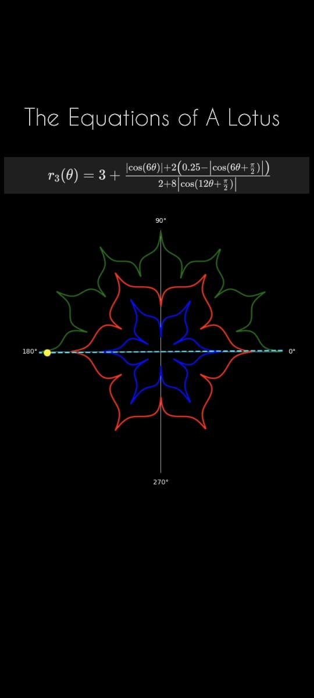

# Mathematics and Nature

## Overview

This hobby project presents a captivating exploration of the intersection between mathematics and nature, manifested through the visualization of lotus flower petals using various mathematical equations. The aim is to demonstrate the intrinsic unity between the natural world and mathematical concepts through an engaging animation that brings the beauty and complexity of a lotus flower to life.

## Features

- **Mathematical Equation Modeling**: Utilizes a variety of mathematical equations to model the structure and form of lotus flower petals.
- **Dynamic Visualization**: Offers an animated portrayal of the lotus flower as it blossoms, showcasing the elegance and precision of mathematics in nature.
- **Interactive Parameters**: Allows users to adjust certain parameters of the mathematical models to explore variations in the lotus flower's appearance.
- **Educational Tool**: Serves as a resource for educators and students alike to appreciate the beauty of mathematics in explaining natural phenomena.

## Contributing

Contributions to enhance the Lotus Flower Mathematics Visualization are welcome. Whether it's improving the equations, refining the animation, or fixing bugs, your input is valuable. Please follow these steps to contribute:

1. Fork the repository.
2. Create a new branch for your feature (`git checkout -b feature/AmazingFeature`).
3. Commit your changes (`git commit -m 'Add some AmazingFeature'`).
4. Push to the branch (`git push origin feature/AmazingFeature`).
5. Open a pull request.

## License

Distributed under the MIT License. See `LICENSE` for more information.
