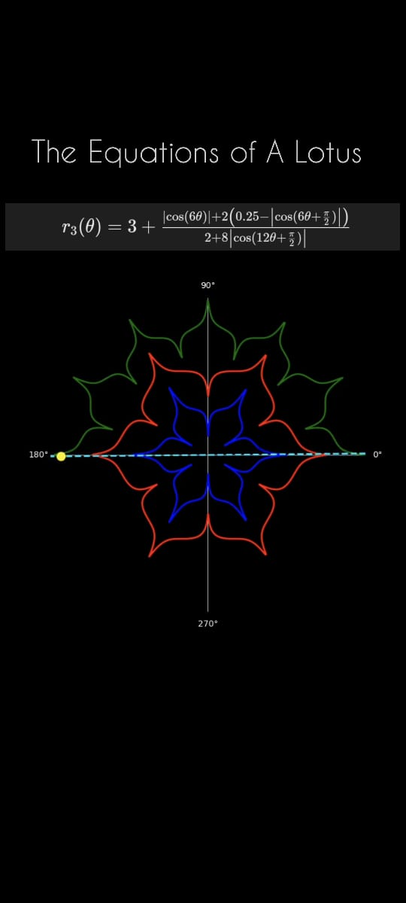
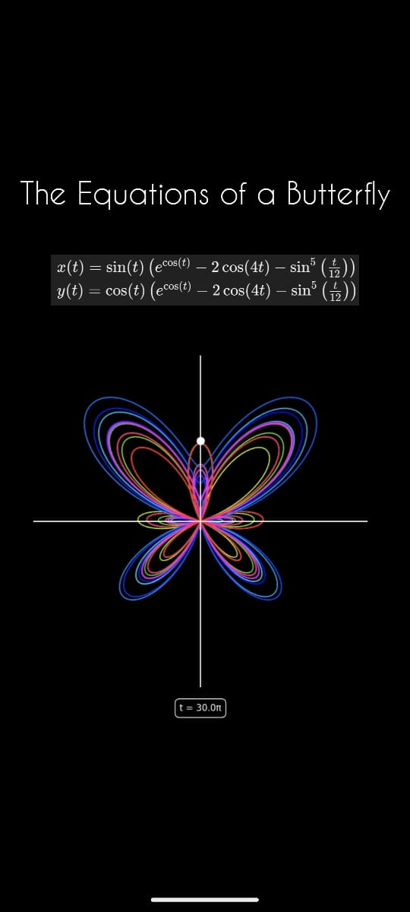

# Mathematics and Nature

 

## Overview

This hobby project presents a captivating exploration of the intersection between mathematics and nature. Through a collection of Jupyter notebooks, it demonstrates how mathematical equations and physical principles can model, simulate, and visualize natural structures and phenomena — from the delicate geometry of flower petals to the wave-like behaviour of quantum particles.

## Visualizations

### 🪷 Lotus Flower (`Lotus_Plot.ipynb`)

Models the structure of a lotus flower using three layered polar equations. The animation sequentially draws each petal layer with a tracing dot and guide line, revealing how simple trigonometric combinations produce organic, flower-like shapes.

- **Equations**: Three polar functions (`r1`, `r2`, `r3`) built from combinations of `cos`, `abs`, and rational expressions, each offset by a `separation_factor` to create concentric petal rings.
- **Animation**: 1500-frame `FuncAnimation` at 30 fps (~50 s), rendered as an HTML5 inline video optimized for 9:16 (portrait) aspect ratio.
- **Dependencies**: `numpy`, `matplotlib`, `IPython.display`
- **Environment**: Google Colab (uses `google.colab.drive` for drive mounting).

---

### 🦋 Butterfly Curve (`Butterfly_Equations.ipynb`)

Visualizes the classic butterfly curve — a parametric equation whose graph resembles the wings of a butterfly. A white tracing dot follows the curve as it is drawn.

- **Technique**: `matplotlib.animation.FuncAnimation` renders the curve frame-by-frame, saving the result as an embedded HTML5 video (`800 × 800` resolution).
- **Known Issue**: The notebook output contains `MatplotlibDeprecationWarning` messages related to `set_data` being called with non-sequence types (_deprecated since matplotlib 3.7_). This should be addressed in a future update to ensure forward compatibility.
- **Dependencies**: `numpy`, `matplotlib`, `IPython.display`
- **Environment**: Google Colab.

---

### 🌹 3D Rose (`Equations_of_Rose.ipynb`)

Constructs a photorealistic 3D rose using a parametric surface equation. The rose "grows" petal-by-petal via an animated rotation, rendered against a black background with a custom `RdPu` (red-purple) colormap and gold edge highlights.

- **Equation**: A single `rose(x, theta)` function returning `(X, Y, Z)` coordinates, built from exponential decay (`phi`), polynomial shaping, and angular modulation.
- **Parameters**: Fully configurable global constants — `THETA_POINTS`, `GRID_FRAMES`, `EXTRA_ROTATION_FRAMES`, `ROTATION_SPEED`, `FPS`, `DPI`, `BITRATE`, etc.
- **Output**: Saved directly to `rose_animation.mp4` via `FFMpegWriter`.
- **Dependencies**: `numpy`, `matplotlib` (including `mpl_toolkits.mplot3d`, `matplotlib.animation`, `matplotlib.colors`)
- **System Requirement**: `ffmpeg` must be installed and available on the system `PATH`.
- **Environment**: Google Colab.

---

### 🔬 Young's Double-Slit Experiment (`Youngs_Double_Slit.ipynb`)

Simulates the quantum-mechanical double-slit experiment for a single electron, showing how a localized wave-packet diffracts through two narrow slits and produces the iconic interference pattern.

- **Physics**: Uses the `qmsolve` library to build a Hamiltonian for a single particle (`m = m_e`) in a 2D potential well containing a double slit, then runs a split-step time simulation.
- **Simulation Parameters** (configurable):
  | Parameter | Value |
  | --- | --- |
  | Slit separation | 2.0 Å |
  | Slit width | 0.7 Å |
  | Slit depth | 0.5 Å |
  | Initial wavefunction σ | 1.0 Å |
  | Initial velocity | 80 Å/fs |
  | Total simulation time | 0.7 fs |
  | Grid size (N) | 512 |
  | Stored steps | 801 |
- **Visualization**: Each frame maps the complex wavefunction `Ψ(x, y, t)` to RGBA colour via HSV conversion, overlaid on a log-scaled potential image. Saved as `double_slit_simulation_reel.mp4` (9:16 portrait, 300 dpi, 30 fps).
- **Dependencies**: `numpy`, `matplotlib`, `qmsolve`
- **System Requirement**: `ffmpeg` must be installed and available on the system `PATH`.
- **Environment**: Google Colab (install `qmsolve` via `!pip install qmsolve`).

## Getting Started

### Prerequisites

- **Python 3.8+**
- **Google Colab** (recommended) — all notebooks are authored and tested in Colab.
- **Alternatively**, run locally with the following installed:
  - `numpy`
  - `matplotlib`
  - `ffmpeg` (system package — required by `Equations_of_Rose.ipynb` and `Youngs_Double_Slit.ipynb`)
  - `qmsolve` (required only by `Youngs_Double_Slit.ipynb`; install via `pip install qmsolve`)

### Running

1. Open any `.ipynb` file in Google Colab (or Jupyter).
2. Run all cells sequentially.
3. Animations will either render inline (HTML5 video) or be saved as `.mp4` files in the working directory.

## Repository Structure

```
Mathematics_And_Nature/
├── Butterfly_Equations.ipynb   # Butterfly curve animation
├── Butterfly_Equations.jpeg    # Example output image
├── Equations_of_Rose.ipynb     # 3D rose surface animation
├── Lotus_Plot.ipynb            # Lotus flower polar-plot animation
├── Lotus_Plot.jpeg             # Example output image
├── Youngs_Double_Slit.ipynb    # Quantum double-slit simulation
├── LICENSE                     # MIT License
├── .gitignore                  # Standard Python/Jupyter gitignore
└── README.md                   # This file
```

## Contributing

Contributions to enhance the Mathematics and Nature visualizations are welcome. Whether it's improving the equations, refining the animations, or fixing bugs, your input is valuable. Please follow these steps to contribute:

1. Fork the repository.
2. Create a new branch for your feature (`git checkout -b feature/AmazingFeature`).
3. Commit your changes (`git commit -m 'Add some AmazingFeature'`).
4. Push to the branch (`git push origin feature/AmazingFeature`).
5. Open a pull request.

## License

Distributed under the MIT License. See `LICENSE` for more information.
